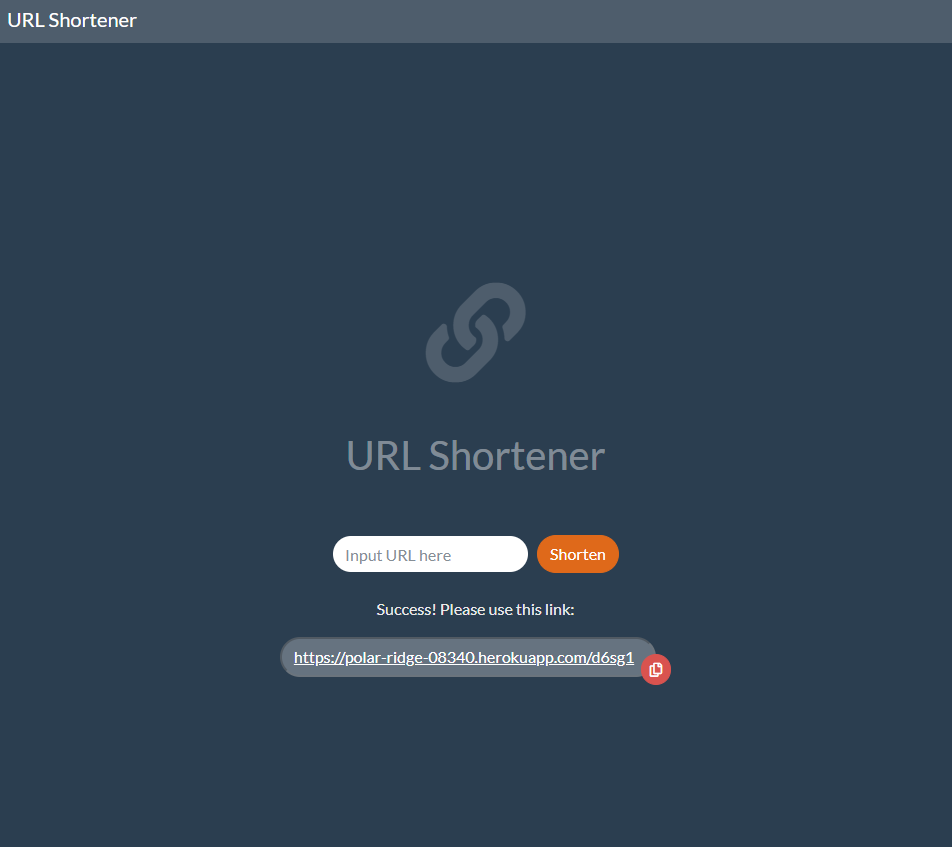

# URL Shortener
A simple web app built with Express.js and MongoDB to generate shortened URL

https://polar-ridge-08340.herokuapp.com/

## Feature
* Shortening URL
* Get previous shortened URL if the URL already exists in the database

## Prerequisite
* Node.js: v10.15.0
* npm: 6.4.1
* nodemon: 2.0.4
* express: 4.17.1
* express-handlebars: 5.1.0
* body-parser: 1.19.0
* mongoDB: 4.2.9
* robo 3T: 1.4.1
* mongoose: 5.10.7

## Installation
1. Enter ` git clone https://github.com/Kaikai8888/url-shortener.git ` in the terminal to download the project folder
2. Use robo 3T to manipulate mongoDB, create connection to `localhost: 27017`, and create the database,`url-shortener`
3. Enter `npm run dev` in the terminal to run app.js with nodemon to set up database connection and start local server 
4. Enter http://localhost:3000 in the browser and enter the website